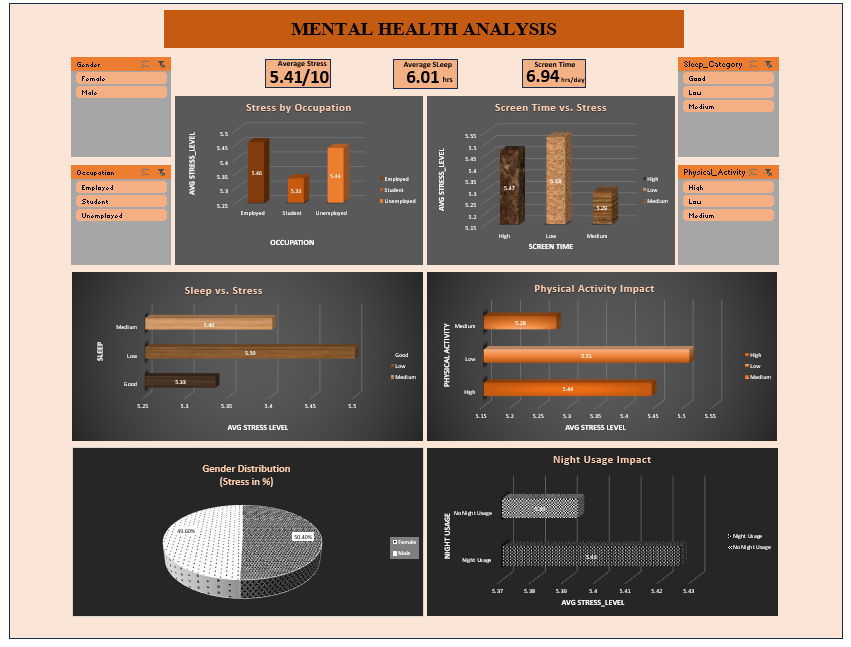

# 🧠 Mental Health Analysis Dashboard | Excel

## 📌 Project Overview

The **Mental Health Analysis Dashboard** is an interactive data analytics project developed using Microsoft Excel to explore the relationship between daily habits, lifestyle factors, and mental well-being.

The dashboard uses Excel's data analysis and visualization features to summarize information related to screen time, social media usage, sleep duration, stress levels, work or study hours, and caffeine consumption.

Designed with a black-and-orange visual theme, the dashboard presents key metrics and analytical insights in an easy-to-understand format. PivotTables, charts, and slicers enable users to explore the data and compare patterns across different categories.

## 🎯 Project Objectives

* Analyze lifestyle factors associated with mental well-being.
* Explore patterns in screen time and social media usage.
* Examine sleep duration and reported stress levels.
* Compare work or study hours with stress-related patterns.
* Explore caffeine consumption across the available data.
* Present key findings through an interactive Excel dashboard.
* Transform raw data into meaningful visual insights for easier interpretation.

## 🛠️ Tools and Technologies

* **Microsoft Excel** – Data analysis and dashboard development.
* **PivotTables** – Data aggregation and category-wise analysis.
* **PivotCharts and Charts** – Visual representation of data patterns.
* **Slicers** – Interactive filtering and exploration.
* **Excel Formulas** – Calculations and data preparation, where applicable.
* **Dashboard Design** – Custom black-and-orange theme for clear visual presentation.

## 📊 Key Metrics and Analysis Areas

The dashboard explores the following lifestyle and well-being indicators:

| Metric               | Description                                       |
| -------------------- | ------------------------------------------------- |
| Screen Time          | Daily time spent using screens                    |
| Social Media Usage   | Time spent on social media                        |
| Sleep Duration       | Hours of sleep                                    |
| Stress Level         | Reported stress level                             |
| Work/Study Hours     | Time spent working or studying                    |
| Caffeine Consumption | Caffeine consumption across the available records |

The dataset includes values or categories for these indicators, with the analysis depending on the available records and their format.

## 🔍 Key Insights

The exploratory analysis highlighted several patterns in the dataset:

* **Employment and Stress:** Employed individuals showed higher stress levels in the analyzed data.
* **Screen Time and Stress:** The dashboard explored stress patterns across different screen-time levels.
* **Social Media and Stress:** Comparisons helped examine how stress levels varied across social media usage categories.
* **Sleep and Well-Being:** Sleep duration was included as a lifestyle factor for examining patterns in reported stress.
* **Work/Study Hours:** Time spent working or studying was analyzed in relation to stress patterns.
* **Caffeine Consumption:** Caffeine usage was included to explore its distribution and potential association with other lifestyle indicators.

These observations describe patterns in the analyzed dataset and should not be interpreted as proof of causation or as clinical conclusions.

## 📈 Dashboard Features

### 1. KPI and Summary Metrics

Provides a summarized view of important metrics available in the dataset.

### 2. Interactive PivotTables

Enables aggregation and comparison of records across selected categories.

### 3. Data Visualization

Uses charts to communicate distributions, comparisons, and patterns across lifestyle indicators.

### 4. Interactive Slicers

Allows users to filter dashboard data and explore selected categories without manually changing the underlying dataset.

### 5. Custom Dashboard Design

Features a black-and-orange color scheme designed to provide visual contrast and organize information clearly.

## 🔄 Project Workflow

1. **Data Understanding:** Reviewed the dataset and identified relevant lifestyle and mental health indicators.
2. **Data Preparation:** Organized the data for analysis in Excel.
3. **Data Analysis:** Used PivotTables and relevant Excel functionality to summarize the available information.
4. **Visualization:** Created charts to represent key metrics and patterns.
5. **Dashboard Development:** Arranged the visualizations and summaries into a consolidated dashboard.
6. **Interactivity:** Added slicers to support dynamic filtering and exploration.
7. **Insight Generation:** Interpreted the resulting patterns to identify notable observations in the dataset.

## 💡 Skills Demonstrated

* Data cleaning and preparation in Excel.
* Exploratory data analysis (EDA).
* PivotTables and PivotCharts.
* Data visualization and dashboard design.
* Interactive reporting using slicers.
* Comparative and category-wise analysis.
* Analytical thinking and insight communication.

## 📂 Project Files

A suggested repository structure is shown below. Adjust the filenames to match your actual files.

```text
MENTAL HEALTH ANALYSIS DASHBOARD/
│
├── assets/
│   ├── mental_health_dashboard.png
│   └── dashboard_details.png
│
├── mental_health_Dashboard.xlsx
└── README.md
```

* `assets/` – Dashboard screenshots for documentation.
* `Mental_Health_Dashboard.xlsx` – Excel workbook containing the analysis and dashboard.
* `README.md` – Project documentation.

## 📸 Dashboard Preview




## 🚀 How to Explore the Project

1. Clone or download this repository.
2. Open `mental_health_Dashboard.xlsx` in Microsoft Excel.
3. Enable editing if prompted.
4. Navigate to the dashboard worksheet.
5. Use the available slicers to filter the data.
6. Explore the charts, summary metrics, and analytical patterns.

**Note:** The workbook's interactive features are best explored in desktop Microsoft Excel.

## 📁 Dataset

The project uses a dataset containing lifestyle and mental well-being indicators, including screen time, social media usage, sleep duration, stress levels, work/study hours, and caffeine consumption.
.

## ⚠️ Limitations

* The dashboard presents exploratory patterns in the available data.
* Observed relationships do not establish cause and effect.
* Findings depend on the quality, completeness, and representativeness of the dataset.
* The dashboard is intended for analytical and educational purposes, not medical diagnosis or clinical assessment.

## 👩‍💻 Author

**Parul Giri**

M.Tech in Computer Science | Aspiring Data Analyst

Interested in data analytics, Excel, SQL, Python, Power BI, and data visualization.

* **GitHub:** (https://github.com/parulgiri11)
* **LinkedIn:** (https://www.linkedin.com/in/parul-giri/)

## ⭐ Conclusion

This project demonstrates how Microsoft Excel can be used to transform raw lifestyle and mental well-being data into an interactive, visually organized dashboard.

By combining PivotTables, charts, slicers, and thoughtful dashboard design, the project showcases practical data analytics skills and the ability to communicate findings through an accessible reporting interface.

---

*Created as part of my Data Analytics portfolio to demonstrate hands-on experience with Excel-based analysis, interactive reporting, and data visualization.*
